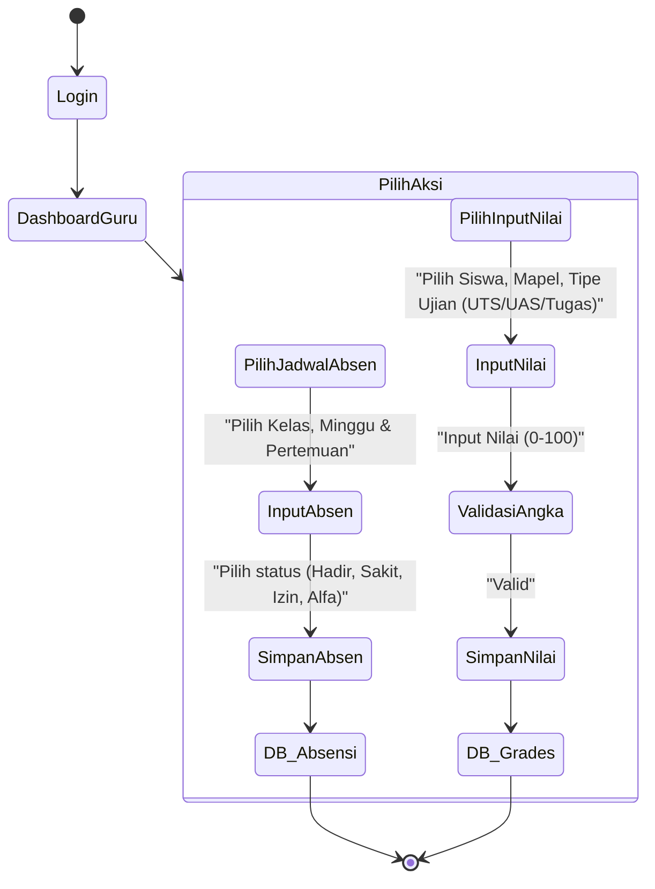

# Activity Diagram - Guru Mapel: Input Nilai & Absensi

```mermaid
stateDiagram-v2
    [*] --> Login
    Login --> DashboardGuru
    DashboardGuru --> PilihAksi
    
    state PilihAksi {
        PilihJadwalAbsen --> InputAbsen : "Pilih Kelas, Minggu & Pertemuan"
        InputAbsen --> SimpanAbsen : "Pilih status (Hadir, Sakit, Izin, Alfa)"
        SimpanAbsen --> DB_Absensi
        
        PilihInputNilai --> InputNilai : "Pilih Siswa, Mapel, Tipe Ujian (UTS/UAS/Tugas)"
        InputNilai --> ValidasiAngka : "Input Nilai (0-100)"
        ValidasiAngka --> SimpanNilai : "Valid"
        SimpanNilai --> DB_Grades
    }
    
    DB_Absensi --> [*]
    DB_Grades --> [*]
```
