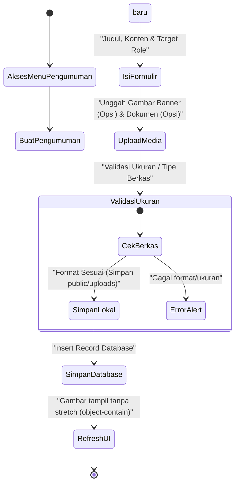

# Activity Diagram - Wali Kelas: CRUD Pengumuman & Media Upload

```mermaid
stateDiagram-v2
    [*] --> AksesMenuPengumuman
    AksesMenuPengumuman --> BuatPengumuman baru
    BuatPengumuman baru --> IsiFormulir : "Judul, Konten & Target Role"
    IsiFormulir --> UploadMedia : "Unggah Gambar Banner (Opsi) & Dokumen (Opsi)"
    UploadMedia --> ValidasiUkuran : "Validasi Ukuran / Tipe Berkas"
    
    state ValidasiUkuran {
        [*] --> CekBerkas
        CekBerkas --> SimpanLokal : "Format Sesuai (Simpan public/uploads)"
        CekBerkas --> ErrorAlert : "Gagal format/ukuran"
    }

    SimpanLokal --> SimpanDatabase : "Insert Record Database"
    SimpanDatabase --> RefreshUI : "Gambar tampil tanpa stretch (object-contain)"
    RefreshUI --> [*]
```
