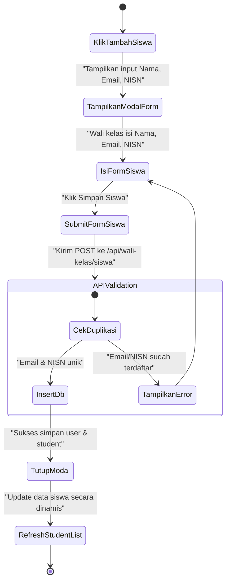

# Activity Diagram - Wali Kelas: Tambah Siswa Baru

```mermaid
stateDiagram-v2
    [*] --> KlikTambahSiswa
    KlikTambahSiswa --> TampilkanModalForm : "Tampilkan input Nama, Email, NISN"
    TampilkanModalForm --> IsiFormSiswa : "Wali kelas isi Nama, Email, NISN"
    IsiFormSiswa --> SubmitFormSiswa : "Klik Simpan Siswa"
    SubmitFormSiswa --> APIValidation : "Kirim POST ke /api/wali-kelas/siswa"
    
    state APIValidation {
        [*] --> CekDuplikasi
        CekDuplikasi --> InsertDb : "Email & NISN unik"
        CekDuplikasi --> TampilkanError : "Email/NISN sudah terdaftar"
    }

    TampilkanError --> IsiFormSiswa
    InsertDb --> TutupModal : "Sukses simpan user & student"
    TutupModal --> RefreshStudentList : "Update data siswa secara dinamis"
    RefreshStudentList --> [*]
```
