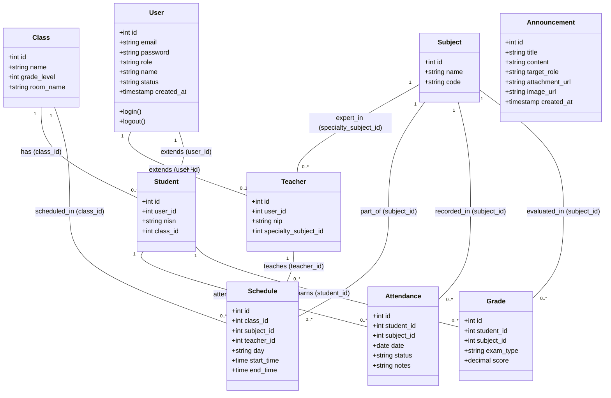

# Class Diagram - EduCore System Entities

```mermaid
classDiagram
    class User {
        +int id
        +string email
        +string password
        +string role
        +string name
        +string status
        +timestamp created_at
        +login()
        +logout()
    }

    class Class {
        +int id
        +string name
        +int grade_level
        +string room_name
    }

    class Subject {
        +int id
        +string name
        +string code
    }

    class Teacher {
        +int id
        +int user_id
        +string nip
        +int specialty_subject_id
    }

    class Student {
        +int id
        +int user_id
        +string nisn
        +int class_id
    }

    class Schedule {
        +int id
        +int class_id
        +int subject_id
        +int teacher_id
        +string day
        +time start_time
        +time end_time
    }

    class Attendance {
        +int id
        +int student_id
        +int subject_id
        +date date
        +string status
        +string notes
    }

    class Grade {
        +int id
        +int student_id
        +int subject_id
        +string exam_type
        +decimal score
    }

    class Announcement {
        +int id
        +string title
        +string content
        +string target_role
        +string attachment_url
        +string image_url
        +timestamp created_at
    }

    %% Relationships
    User "1" -- "0..1" Teacher : extends (user_id)
    User "1" -- "0..1" Student : extends (user_id)
    Class "1" -- "0..*" Student : has (class_id)
    Class "1" -- "0..*" Schedule : scheduled_in (class_id)
    Subject "1" -- "0..*" Teacher : expert_in (specialty_subject_id)
    Subject "1" -- "0..*" Schedule : part_of (subject_id)
    Subject "1" -- "0..*" Attendance : recorded_in (subject_id)
    Subject "1" -- "0..*" Grade : evaluated_in (subject_id)
    Teacher "1" -- "0..*" Schedule : teaches (teacher_id)
    Student "1" -- "0..*" Attendance : attends (student_id)
    Student "1" -- "0..*" Grade : earns (student_id)
```
