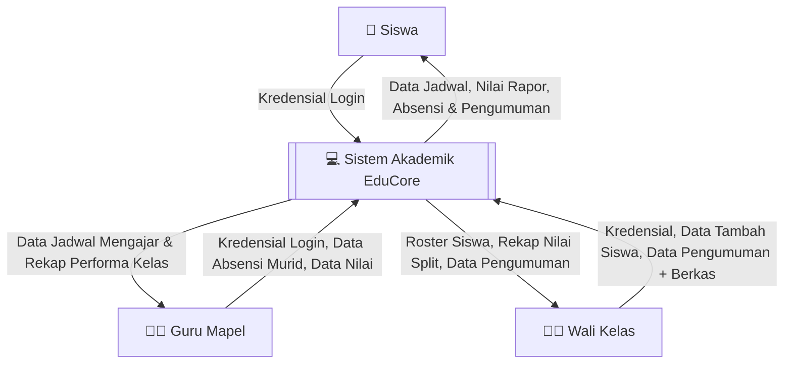

# Data Flow Diagram (DFD) Level 0 - Sistem Akademik EduCore

```mermaid
graph TD
    Siswa["👤 Siswa"]
    GuruMapel["🧑‍🏫 Guru Mapel"]
    WaliKelas["🧑‍💼 Wali Kelas"]
    System[["💻 Sistem Akademik EduCore"]]

    %% Aliran Siswa
    Siswa -- "Kredensial Login" --> System
    System -- "Data Jadwal, Nilai Rapor, Absensi & Pengumuman" --> Siswa

    %% Aliran Guru Mapel
    GuruMapel -- "Kredensial Login, Data Absensi Murid, Data Nilai" --> System
    System -- "Data Jadwal Mengajar & Rekap Performa Kelas" --> GuruMapel

    %% Aliran Wali Kelas
    WaliKelas -- "Kredensial, Data Tambah Siswa, Data Pengumuman + Berkas" --> System
    System -- "Roster Siswa, Rekap Nilai Split, Data Pengumuman" --> WaliKelas
```
