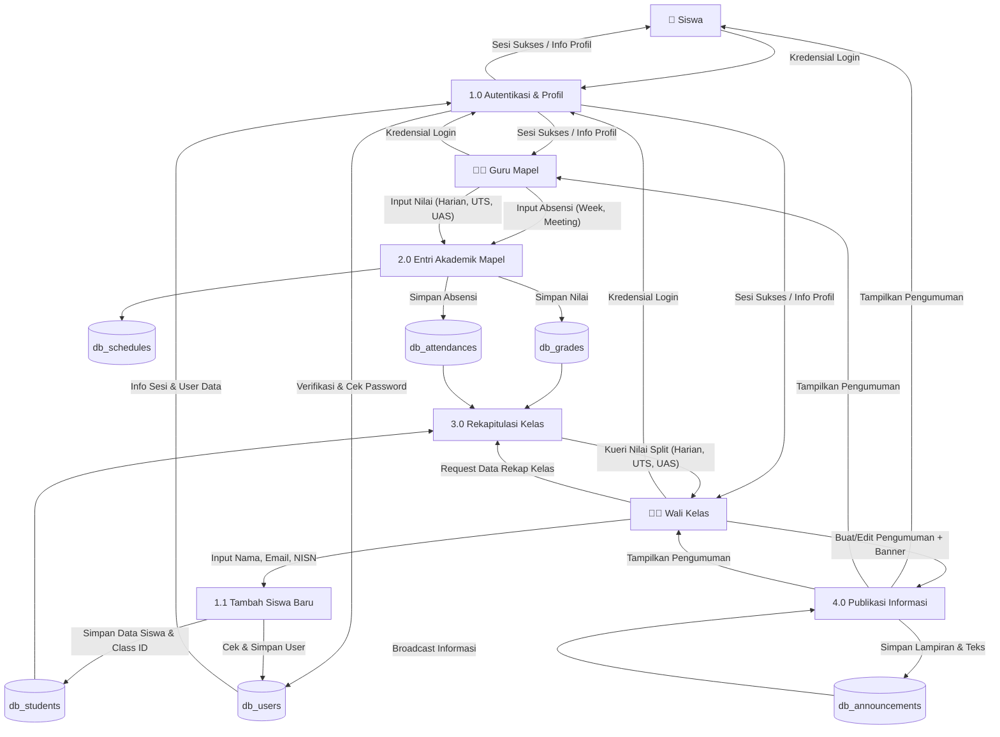

# Data Flow Diagram (DFD) Level 1 - Sistem Akademik EduCore

```mermaid
flowchart TD
    %% Entitas
    S["👤 Siswa"]
    G["🧑‍🏫 Guru Mapel"]
    W["🧑‍💼 Wali Kelas"]

    %% Proses
    P1["1.0 Autentikasi & Profil"]
    P11["1.1 Tambah Siswa Baru"]
    P2["2.0 Entri Akademik Mapel"]
    P3["3.0 Rekapitulasi Kelas"]
    P4["4.0 Publikasi Informasi"]

    %% Data Stores
    D1[("db_users")]
    D2[("db_schedules")]
    D3[("db_grades")]
    D4[("db_attendances")]
    D5[("db_announcements")]
    D6[("db_students")]

    %% Aliran Proses 1.0
    S & G & W -- "Kredensial Login" --> P1
    P1 -- "Verifikasi & Cek Password" --> D1
    D1 -- "Info Sesi & User Data" --> P1
    P1 -- "Sesi Sukses / Info Profil" --> S & G & W

    %% Aliran Proses 1.1 (Tambah Siswa Baru)
    W -- "Input Nama, Email, NISN" --> P11
    P11 -- "Cek & Simpan User" --> D1
    P11 -- "Simpan Data Siswa & Class ID" --> D6

    %% Aliran Proses 2.0
    G -- "Input Absensi (Week, Meeting)" --> P2
    G -- "Input Nilai (Harian, UTS, UAS)" --> P2
    P2 --> D2
    P2 -- "Simpan Nilai" --> D3
    P2 -- "Simpan Absensi" --> D4

    %% Aliran Proses 3.0
    W -- "Request Data Rekap Kelas" --> P3
    D3 & D4 & D6 --> P3
    P3 -- "Kueri Nilai Split (Harian, UTS, UAS)" --> W

    %% Aliran Proses 4.0
    W -- "Buat/Edit Pengumuman + Banner" --> P4
    P4 -- "Simpan Lampiran & Teks" --> D5
    D5 -- "Broadcast Informasi" --> P4
    P4 -- "Tampilkan Pengumuman" --> S & G & W
```
