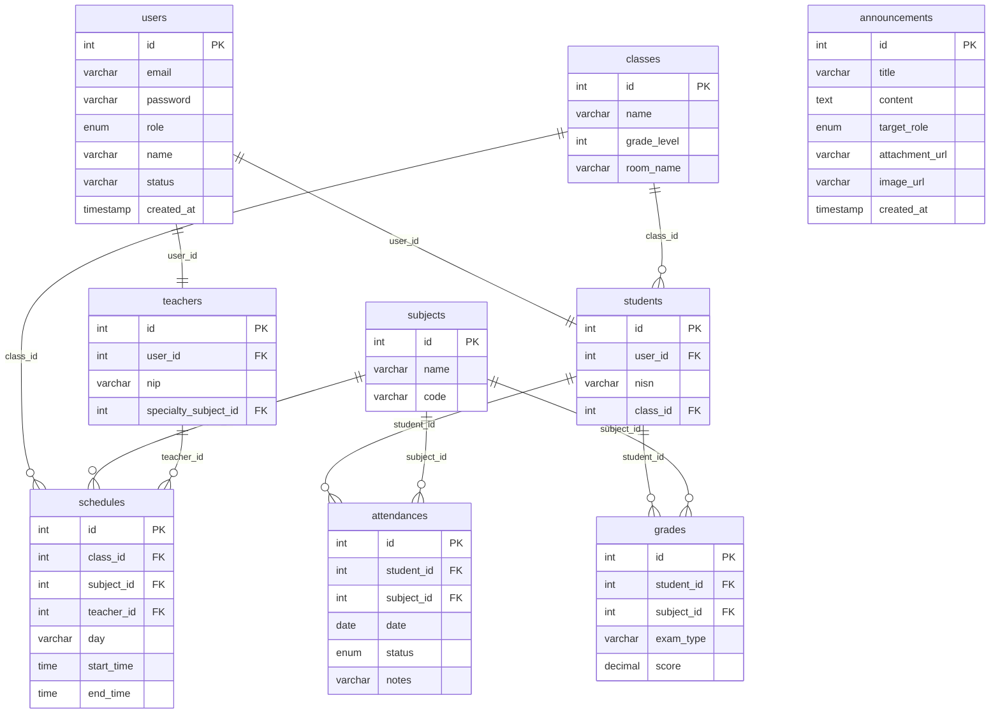

# Entity Relationship Diagram (ERD) - Sistem Akademik EduCore

```mermaid
erDiagram
    users {
        int id PK
        varchar email
        varchar password
        enum role
        varchar name
        varchar status
        timestamp created_at
    }
    classes {
        int id PK
        varchar name
        int grade_level
        varchar room_name
    }
    subjects {
        int id PK
        varchar name
        varchar code
    }
    teachers {
        int id PK
        int user_id FK
        varchar nip
        int specialty_subject_id FK
    }
    students {
        int id PK
        int user_id FK
        varchar nisn
        int class_id FK
    }
    schedules {
        int id PK
        int class_id FK
        int subject_id FK
        int teacher_id FK
        varchar day
        time start_time
        time end_time
    }
    attendances {
        int id PK
        int student_id FK
        int subject_id FK
        date date
        enum status
        varchar notes
    }
    grades {
        int id PK
        int student_id FK
        int subject_id FK
        varchar exam_type
        decimal score
    }
    announcements {
        int id PK
        varchar title
        text content
        enum target_role
        varchar attachment_url
        varchar image_url
        timestamp created_at
    }

    users ||--|| teachers : "user_id"
    users ||--|| students : "user_id"
    classes ||--o{ students : "class_id"
    classes ||--o{ schedules : "class_id"
    subjects ||--o{ schedules : "subject_id"
    teachers ||--o{ schedules : "teacher_id"
    students ||--o{ attendances : "student_id"
    subjects ||--o{ attendances : "subject_id"
    students ||--o{ grades : "student_id"
    subjects ||--o{ grades : "subject_id"
```
