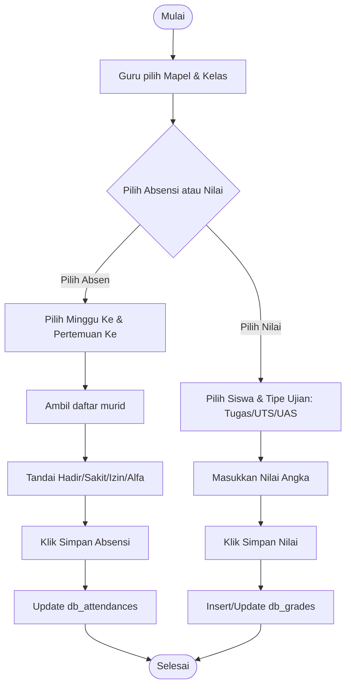

# Flowchart - Alur Penjadwalan & Input Nilai/Absensi Guru

```mermaid
flowchart TD
    Start([Mulai]) --> SelectClassMapel[Guru pilih Mapel & Kelas]
    SelectClassMapel --> ChooseAction{Pilih Absensi atau Nilai}
    
    ChooseAction -- "Pilih Absen" --> SelectWeekMeeting[Pilih Minggu Ke & Pertemuan Ke]
    SelectWeekMeeting --> FetchAttend[Ambil daftar murid]
    FetchAttend --> InputStatus[Tandai Hadir/Sakit/Izin/Alfa]
    InputStatus --> SaveAttend[Klik Simpan Absensi]
    SaveAttend --> DbSaveAbs[Update db_attendances]
    
    ChooseAction -- "Pilih Nilai" --> SelectExamType[Pilih Siswa & Tipe Ujian: Tugas/UTS/UAS]
    SelectExamType --> InputScore[Masukkan Nilai Angka]
    InputScore --> SaveScore[Klik Simpan Nilai]
    SaveScore --> DbSaveGrade[Insert/Update db_grades]
    
    DbSaveAbs & DbSaveGrade --> End([Selesai])
```
