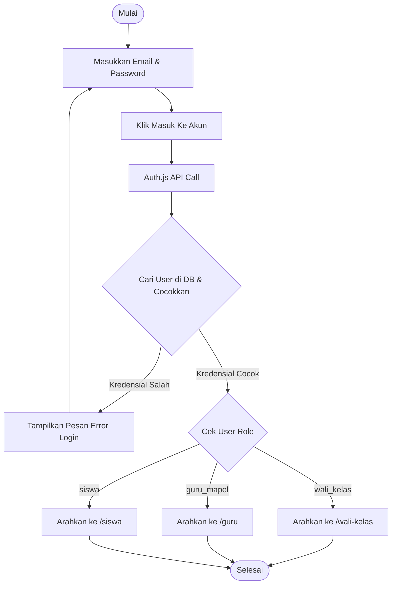

# Flowchart - Proses Login & Route Redirection berdasarkan Role

```mermaid
flowchart TD
    Start([Mulai]) --> LoginInput[Masukkan Email & Password]
    LoginInput --> Submit[Klik Masuk Ke Akun]
    Submit --> APIAuth[Auth.js API Call]
    APIAuth --> DBQuery{Cari User di DB & Cocokkan}
    DBQuery -- "Kredensial Salah" --> ErrorAlert[Tampilkan Pesan Error Login]
    ErrorAlert --> LoginInput
    DBQuery -- "Kredensial Cocok" --> CheckRole{Cek User Role}
    
    CheckRole -- "wali_kelas" --> RedirectWali[Arahkan ke /wali-kelas]
    CheckRole -- "guru_mapel" --> RedirectGuru[Arahkan ke /guru]
    CheckRole -- "siswa" --> RedirectSiswa[Arahkan ke /siswa]
    
    RedirectWali & RedirectGuru & RedirectSiswa --> End([Selesai])
```
