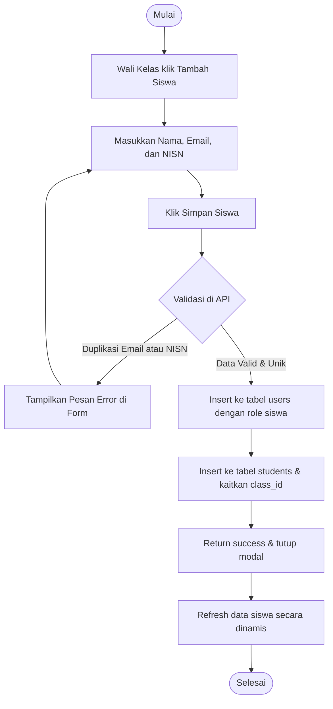

# Flowchart - Alur Tambah Siswa Baru oleh Wali Kelas

```mermaid
flowchart TD
    Start([Mulai]) --> OpenForm[Wali Kelas klik Tambah Siswa]
    OpenForm --> InputData[Masukkan Nama, Email, dan NISN]
    InputData --> ClickSave[Klik Simpan Siswa]
    ClickSave --> APIValidate{Validasi di API}
    
    APIValidate -- "Duplikasi Email atau NISN" --> ErrorMsg[Tampilkan Pesan Error di Form]
    ErrorMsg --> InputData
    
    APIValidate -- "Data Valid & Unik" --> InsertUsers[Insert ke tabel users dengan role siswa]
    InsertUsers --> InsertStudents[Insert ke tabel students & kaitkan class_id]
    InsertStudents --> SuccessResponse[Return success & tutup modal]
    SuccessResponse --> RefreshList[Refresh data siswa secara dinamis]
    RefreshList --> End([Selesai])
```
