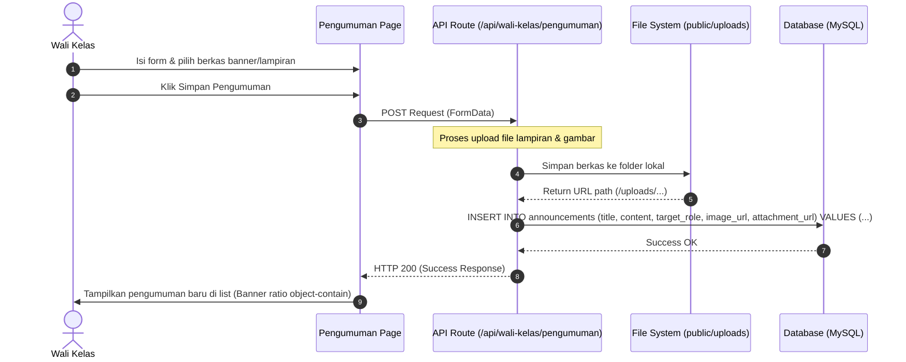

# Sequence Diagram - CRUD Announcement (Wali Kelas)

```mermaid
sequenceDiagram
    autonumber
    actor Wali as Wali Kelas
    participant Client as Pengumuman Page
    participant Route as API Route (/api/wali-kelas/pengumuman)
    participant FS as File System (public/uploads)
    participant DB as Database (MySQL)

    Wali->>Client: Isi form & pilih berkas banner/lampiran
    Wali->>Client: Klik Simpan Pengumuman
    Client->>Route: POST Request (FormData)
    Note over Route: Proses upload file lampiran & gambar
    Route->>FS: Simpan berkas ke folder lokal
    FS-->>Route: Return URL path (/uploads/...)
    Route->>DB: INSERT INTO announcements (title, content, target_role, image_url, attachment_url) VALUES (...)
    DB-->>Route: Success OK
    Route-->>Client: HTTP 200 (Success Response)
    Client->>Wali: Tampilkan pengumuman baru di list (Banner ratio object-contain)
```
