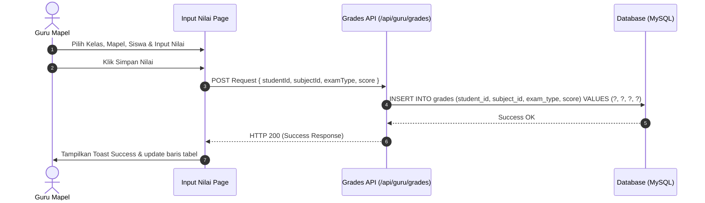

# Sequence Diagram - Input & Submit Grades (Guru Mapel)

```mermaid
sequenceDiagram
    autonumber
    actor Guru as Guru Mapel
    participant Client as Input Nilai Page
    participant Route as Grades API (/api/guru/grades)
    participant DB as Database (MySQL)

    Guru->>Client: Pilih Kelas, Mapel, Siswa & Input Nilai
    Guru->>Client: Klik Simpan Nilai
    Client->>Route: POST Request { studentId, subjectId, examType, score }
    Route->>DB: INSERT INTO grades (student_id, subject_id, exam_type, score) VALUES (?, ?, ?, ?)
    DB-->>Route: Success OK
    Route-->>Client: HTTP 200 (Success Response)
    Client->>Guru: Tampilkan Toast Success & update baris tabel
```
