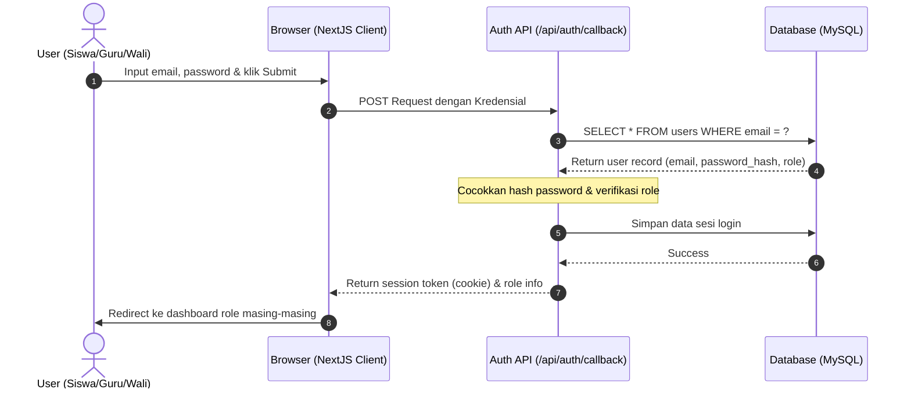

# Sequence Diagram - Autentikasi / Login Flow

```mermaid
sequenceDiagram
    autonumber
    actor User as User (Siswa/Guru/Wali)
    participant Client as Browser (NextJS Client)
    participant Route as Auth API (/api/auth/callback)
    participant DB as Database (MySQL)

    User->>Client: Input email, password & klik Submit
    Client->>Route: POST Request dengan Kredensial
    Route->>DB: SELECT * FROM users WHERE email = ?
    DB-->>Route: Return user record (email, password_hash, role)
    Note over Route: Cocokkan hash password & verifikasi role
    Route->>DB: Simpan data sesi login
    DB-->>Route: Success
    Route-->>Client: Return session token (cookie) & role info
    Client->>User: Redirect ke dashboard role masing-masing
```
