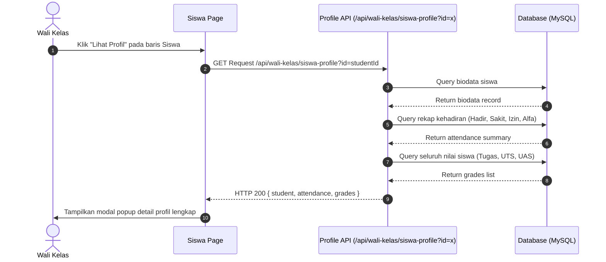

# Sequence Diagram - View Student Profile Modal (Wali Kelas)

```mermaid
sequenceDiagram
    autonumber
    actor Wali as Wali Kelas
    participant Client as Siswa Page
    participant Route as Profile API (/api/wali-kelas/siswa-profile?id=x)
    participant DB as Database (MySQL)

    Wali->>Client: Klik "Lihat Profil" pada baris Siswa
    Client->>Route: GET Request /api/wali-kelas/siswa-profile?id=studentId
    Route->>DB: Query biodata siswa
    DB-->>Route: Return biodata record
    Route->>DB: Query rekap kehadiran (Hadir, Sakit, Izin, Alfa)
    DB-->>Route: Return attendance summary
    Route->>DB: Query seluruh nilai siswa (Tugas, UTS, UAS)
    DB-->>Route: Return grades list
    Route-->>Client: HTTP 200 { student, attendance, grades }
    Client->>Wali: Tampilkan modal popup detail profil lengkap
```
