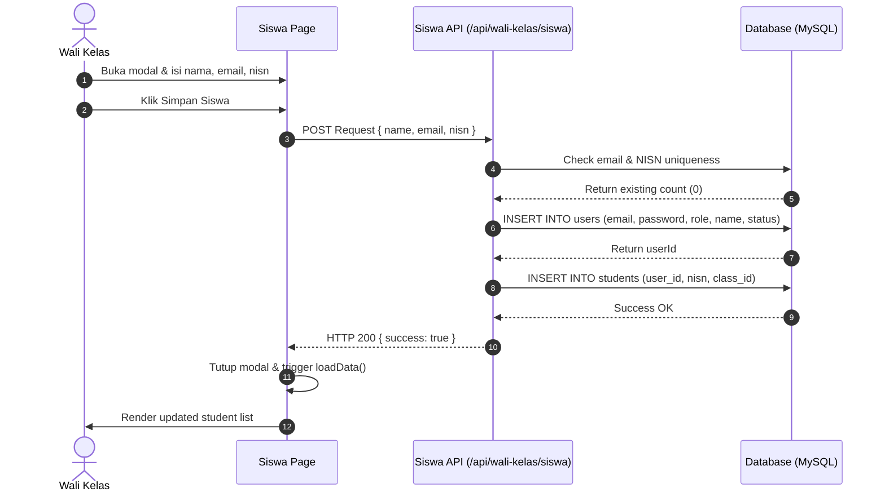

# Sequence Diagram - Tambah Siswa Baru (Wali Kelas)

```mermaid
sequenceDiagram
    autonumber
    actor Wali as Wali Kelas
    participant Client as Siswa Page
    participant Route as Siswa API (/api/wali-kelas/siswa)
    participant DB as Database (MySQL)

    Wali->>Client: Buka modal & isi nama, email, nisn
    Wali->>Client: Klik Simpan Siswa
    Client->>Route: POST Request { name, email, nisn }
    Route->>DB: Check email & NISN uniqueness
    DB-->>Route: Return existing count (0)
    Route->>DB: INSERT INTO users (email, password, role, name, status)
    DB-->>Route: Return userId
    Route->>DB: INSERT INTO students (user_id, nisn, class_id)
    DB-->>Route: Success OK
    Route-->>Client: HTTP 200 { success: true }
    Client->>Client: Tutup modal & trigger loadData()
    Client->>Wali: Render updated student list
```
