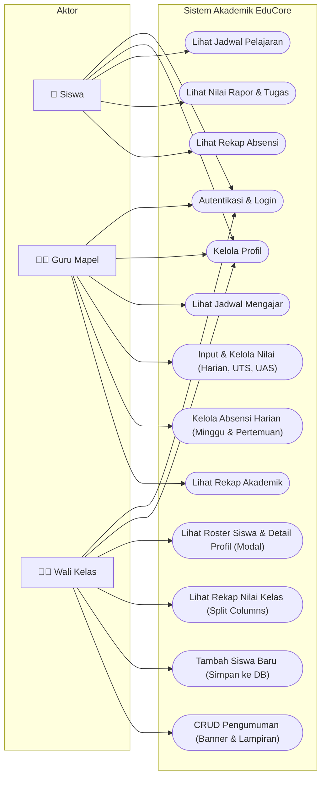

# Use Case Diagram - Sistem Akademik EduCore

```mermaid
graph LR
    subgraph Aktor
        Siswa["👤 Siswa"]
        Guru["🧑‍🏫 Guru Mapel"]
        Wali["🧑‍💼 Wali Kelas"]
    end

    subgraph "Sistem Akademik EduCore"
        UC_Login(["Autentikasi & Login"])
        UC_Profile(["Kelola Profil"])
        UC_JadwalSiswa(["Lihat Jadwal Pelajaran"])
        UC_NilaiSiswa(["Lihat Nilai Rapor & Tugas"])
        UC_AbsenSiswa(["Lihat Rekap Absensi"])
        
        UC_JadwalGuru(["Lihat Jadwal Mengajar"])
        UC_InputNilai(["Input & Kelola Nilai (Harian, UTS, UAS)"])
        UC_InputAbsen(["Kelola Absensi Harian (Minggu & Pertemuan)"])
        UC_RekapGuru(["Lihat Rekap Akademik"])

        UC_SiswaBinaan(["Lihat Roster Siswa & Detail Profil (Modal)"])
        UC_RekapWali(["Lihat Rekap Nilai Kelas (Split Columns)"])
        UC_TambahSiswa(["Tambah Siswa Baru (Simpan ke DB)"])
        UC_CRUDAnnounce(["CRUD Pengumuman (Banner & Lampiran)"])
    end

    %% Hubungan Aktor dengan Use Case
    Siswa --> UC_Login
    Siswa --> UC_Profile
    Siswa --> UC_JadwalSiswa
    Siswa --> UC_NilaiSiswa
    Siswa --> UC_AbsenSiswa

    Guru --> UC_Login
    Guru --> UC_Profile
    Guru --> UC_JadwalGuru
    Guru --> UC_InputNilai
    Guru --> UC_InputAbsen
    Guru --> UC_RekapGuru

    Wali --> UC_Login
    Wali --> UC_Profile
    Wali --> UC_SiswaBinaan
    Wali --> UC_RekapWali
    Wali --> UC_TambahSiswa
    Wali --> UC_CRUDAnnounce
```
